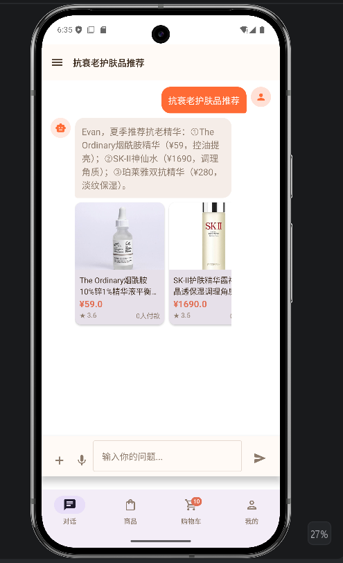
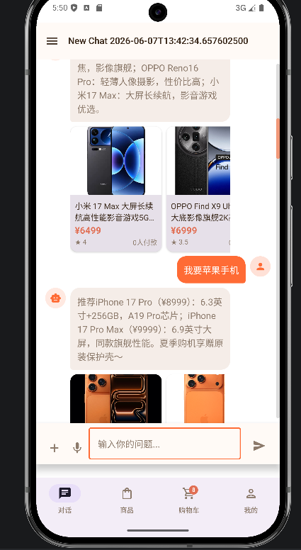
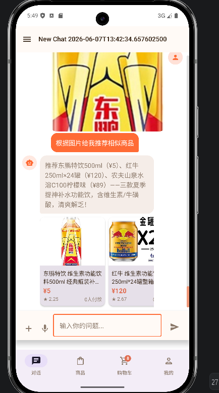
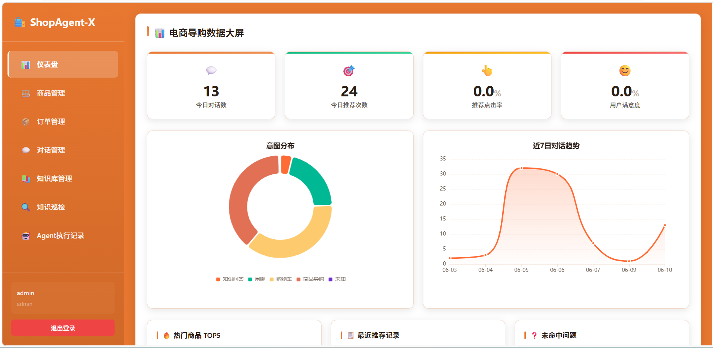
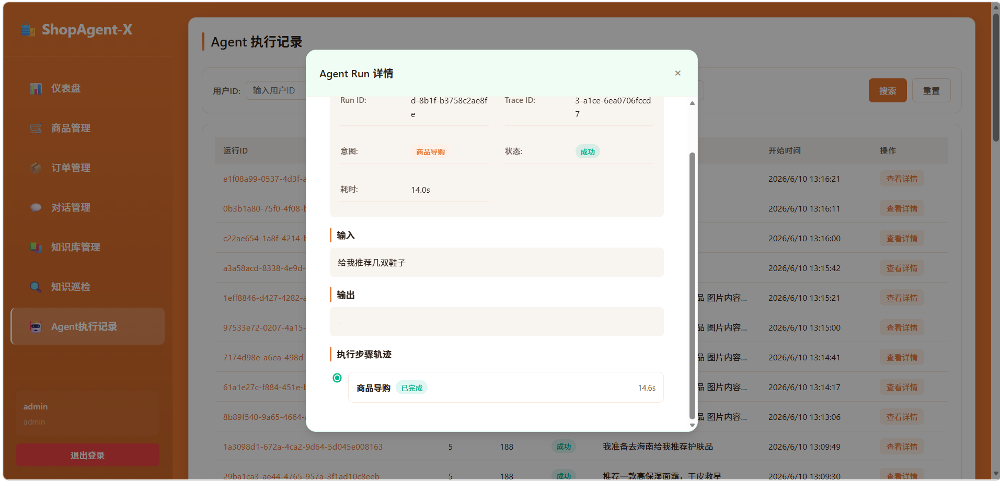
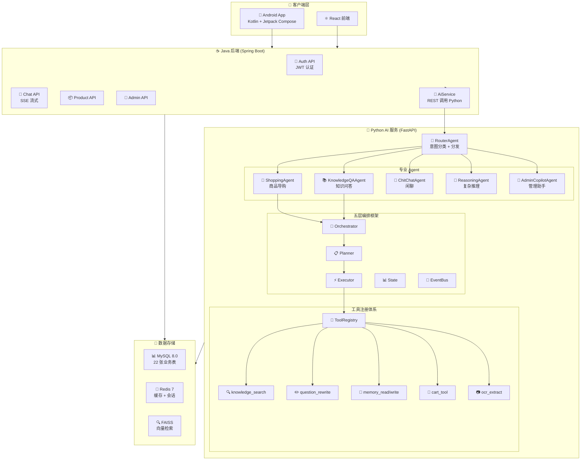
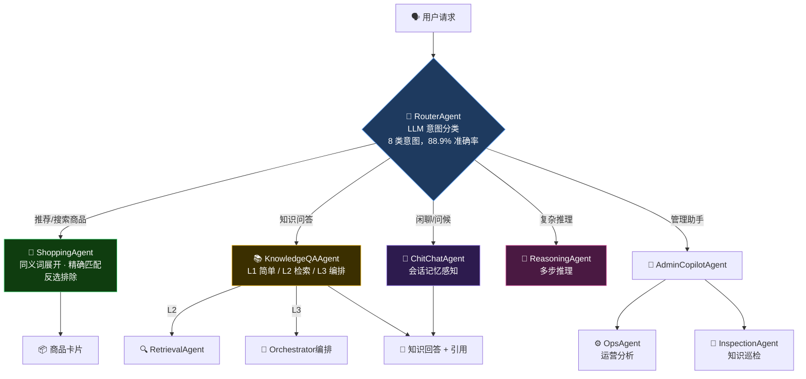
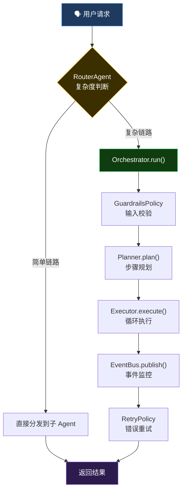

<div align="center">

# 🛒 ShopAgent-X — RAG 多模态电商导购 AI Agent

**基于 RAG + 多 Agent 编排的智能电商购物导购系统，支持自然语言对话、图像识别、语音输入等多模态交互，实现从"浏览"到"购买决策"的全链路智能导购。**

[](https://openjdk.org/)
[](https://spring.io/projects/spring-boot)
[](https://python.org/)
[](https://fastapi.tiangolo.com/)
[](https://kotlinlang.org/)
[](https://developer.android.com/jetpack/compose)
[](https://mysql.com/)
[](https://redis.io/)
[](https://github.com/facebookresearch/faiss)

</div>

---

## 📖 项目简介

ShopAgent-X 是一个面向电商场景的**多模态智能导购 AI Agent 系统**。用户可以通过**自然语言对话、拍照识图、语音输入**等方式与 AI 交互，获取个性化商品推荐、购物车管理等完整购物体验。

核心亮点是**五层可编排 Agent 架构**——RouterAgent 自动识别用户意图并分发给 9 个专业子 Agent，通过统一 Tool Registry 管理 7 个 AI 工具，支持简单链路直接分发与复杂链路 Orchestrator 编排两种模式。

### 适用场景

- **智能电商导购**：用户通过自然语言描述需求，AI 理解意图后检索商品库，生成个性化推荐话术和商品卡片
- **多模态交互**：拍照识别商品找同款、语音输入购物需求、对话式购物车管理
- **RAG 知识问答**：基于商品知识库的语义检索，回答商品相关的专业问题
- **Agent 架构学习**：项目涵盖 RAG 全链路、多 Agent 协作、Tool Registry、SSE 流式输出等核心知识点

**一句话总结**：不只是一个电商推荐系统，更是一个多 Agent 协作的 AI 导购架构实践。

---

## 📸 应用展示

<div align="center">

| 商品推荐 | 语义推荐 | 识图推荐 |
|:---:|:---:|:---:|
|  |  |  |

| 仪表盘 | Agent 监控 |
|:---:|:---:|
|  |  |

</div>

### 演示视频

| 视频 | 说明 |
|------|------|
| [常规对话演示](docs/screenshots/常规演示1.mp4) | 商品推荐、知识问答等日常对话场景 |
| [拍照识图 & 语音识别](docs/screenshots/拍照识图，语音识别展示.mp4) | 多模态交互：拍照找同款、语音输入 |
| [管理端演示](docs/screenshots/管理端演示.mp4) | 后台管理系统功能演示 |

---

## 🏗️ 系统架构



### 多 Agent 协作拓扑



---

## ✨ 核心亮点

### 亮点一：五层可编排 Agent 架构

将 AI 服务拆分为 **Orchestrator → Planner → Executor → State → Events + Policies** 五层，支持简单链路直接分发与复杂链路完整编排两种模式。



**关键代码：**
- `agent/orchestrator.py` — 编排器，创建 state、调用 planner、逐步执行
- `agent/planner.py` — 规划器，根据意图生成执行步骤
- `agent/executor.py` — 执行器，根据 step_type 分发到具体实现
- `agent/state.py` — 状态管理，run_id / trace_id / step 追踪
- `agent/events.py` — 事件总线 + MetricsCollector 监控

---

### 亮点二：多 Agent 协作机制

9 个专业 Agent 以 RouterAgent 为中心进行意图分类和任务分发，每个 Agent 职责单一、接口统一（AgentResponse 基类），通过 ToolRegistry 共享工具能力。

**核心能力：**
- **意图分类**：8 类意图（shopping / knowledge / chitchat / comparison / cart / admin / reasoning / photo），88.9% 准确率
- **购物导购**：同义词展开 + 精确匹配 + 反选排除
- **知识问答**：L1 直答 / L2 检索 / L3 Orchestrator 编排，三级复杂度自动判断
- **购物车管理**：对话式加购、删除、批量操作，30s 会话缓存

**关键代码：**
- `workflows/router_agent.py` — 中央路由，意图分类 + 统一记忆写入
- `workflows/shopping_agent.py` — 购物导购，1700+ 行核心逻辑
- `workflows/knowledge_qa_agent.py` — 三级复杂度知识问答
- `workflows/agent_response.py` — 统一 Agent 返回格式

---

### 亮点三：统一 Tool 工具注册体系

遵循**注册 → 发现 → 调用**模式，每个工具继承 Tool 基类，声明输入输出 Schema，通过 ToolRegistry 统一管理。


**已注册工具（7 个）：**

| 工具 | 功能 | 调用场景 |
|------|------|---------|
| `knowledge_search` | 知识库语义检索 | KnowledgeQAAgent |
| `question_rewrite` | 问题改写 + 画像感知 | ShoppingAgent / RetrievalAgent |
| `rerank` | 检索结果重排序 | KnowledgeQAAgent |
| `memory_read` | 会话记忆读取 | 所有 Agent |
| `memory_write` | 会话记忆写入 | RouterAgent（统一入口） |
| `ocr_extract` | 图片文字提取 | 拍照识图 |
| `cart_tool` | 购物车 CRUD | ShoppingAgent |

**关键代码：**
- `tools/registry.py` — 工具注册中心，单例 + 共享线程池（max_workers=10）
- `tools/execution.py` — 执行跟踪，TTL 3600s + 容量上限 1000 + 自动淘汰
- `tools/base.py` — 工具基类，定义 name / description / execute 接口

---

## 🔧 关键问题解决方案

### 1. RAG 检索精度优化

**问题**：用户说"推荐跑鞋"，拆字逻辑把"跑"和"鞋"单独匹配，导致篮球鞋也混入结果。

**解决方案**：四级搜索流水线

```
用户问题
  → Step 1: LLM 提取排除词（"不要优衣库" → ["优衣库"]）
  → Step 2: LLM + 正则提取搜索关键词（双保险）
  → Step 3: 三级优先级匹配
       精确匹配: "跑鞋" → 只匹配"跑步鞋"，不展开
       泛词展开: "鞋子" → ["篮球鞋","跑步鞋","徒步鞋","运动鞋"]
       拆字匹配: 中文单字拆分模糊搜索
  → Step 4: SQL 参数化搜索 + 品类过滤 + 排除词过滤
  → Step 5: 后处理 → 去重 + 状态过滤 + 加权排序（评分60% + 销量40%）
```

**关键代码**：`workflows/shopping_agent.py` — `_search_products()` 四级搜索流水线

### 2. 防幻觉机制

**问题**：LLM 可能编造不存在的商品、价格、评分等数据。

**解决方案**：三层防幻觉

| 层级 | 机制 | 说明 |
|------|------|------|
| Prompt 约束 | LLM Prompt 明确指令 | "不要编造价格/评分/销量数据"、"不要推荐商品信息中没有的商品" |
| 输出校验 | validateProductCards() | 用 product_id 查数据库，比对价格/标题/状态，不一致则用数据库数据覆盖 |
| 参数化查询 | SQL 注入修复 | CASE 表达式从 f-string 改为参数化查询，防止恶意输入 |

**关键代码**：
- `service/impl/ChatServiceImpl.java` — `validateProductCards()` 校验逻辑
- `workflows/shopping_agent.py` — `_validate_llm_prices()` 价格校验

### 3. 多模态交互接入

**拍照识图**：豆包 Vision API 理解图片语义 → 提取商品特征 → 搜索推荐

```
Android 拍照/选图
  → Java 上传图片 → Python 调用豆包 Vision API
  → 返回描述（如"一双白色Nike运动鞋"）
  → 作为搜索词走 ShoppingAgent 检索链路
  → 返回推荐商品 + 商品卡片
```

**语音输入**：豆包多模态 ASR API 语音识别

```
Android 长按录音 → 音频文件
  → Java 透传 → Python 调用豆包 ASR API
  → 返回文本 → 作为普通消息走对话链路
```

**关键代码**：
- `core/llm.py` — `extract_text_from_image()` + `recognize_voice()`
- `api/routes.py` — `/recognize-image` + `/voice/recognize`

### 4. Agent 编排设计决策

**问题**：所有请求都走 Orchestrator 编排会增加延迟，但简单请求不需要完整编排。

**解决方案**：分层路由，按复杂度选择执行路径

| 复杂度 | 路径 | 示例 | 延迟 |
|--------|------|------|------|
| 简单 | RouterAgent → 子 Agent 直接返回 | "推荐跑鞋" / "你好" | ~2s |
| 中等 | RouterAgent → 子 Agent → Tool 调用 | "这款手机参数是什么" | ~4s |
| 复杂 | RouterAgent → Orchestrator → Planner → Executor | 多步知识问答 L3 | ~8s |

**决策依据**：
- 简单链路（闲聊、单次商品检索）直接分发，避免编排开销
- 复杂链路（多步推理、知识问答 L3）走完整编排，保证错误重试、状态追踪、事件监控

---

## 💡 业务亮点特色

### 对话式购物车管理

用户通过自然语言控制购物车，无需手动操作：

| 指令 | 示例 |
|------|------|
| 加购 | "把这个加到购物车" |
| 泛化加购 | "添加购物车"（显示选择卡片让用户勾选） |
| 删除 | "删除第二个商品" |
| 批量删除 | "删除前两个" / "清空购物车" |
| 查看 | "看看我的购物车" |

### 反选排除

用户可以说"不要"来排除特定品牌或属性：

> "推荐防晒霜，但不要含酒精的"

LLM 提取排除词 → 搜索时过滤掉匹配商品 → 只返回符合条件的结果

### 用户画像感知

注册时收集用户偏好（性别/肤质/偏好标签），推荐时自动适配：

- 油皮用户搜洗面奶 → 优先推荐控油款
- 偏好运动 → 运动品类排序靠前
- 推荐话术自动调整称呼（兄弟/姐妹）

### 多轮上下文记忆

Agent 记住对话历史，支持渐进式需求收敛：

```
用户: "推荐跑鞋"
AI:   [推荐5款跑鞋]
用户: "要轻量的"
AI:   [从上一轮结果中筛选轻量款]
用户: "不要超过五百"
AI:   [进一步按价格过滤]
```

---

## 🛠️ 技术栈

### Android 客户端

| 技术 | 版本 | 用途 |
|------|------|------|
| Kotlin | 2.0 | 开发语言 |
| Jetpack Compose | - | 声明式 UI |
| Material3 | - | Material Design 3 |
| Hilt | - | 依赖注入 |
| Retrofit + OkHttp | - | 网络请求 |
| SSE Client | - | 流式接收 AI 回复 |
| CameraX | - | 拍照识图 |
| MediaRecorder | - | 语音录制 |
| minSdk / targetSdk | 24 / 36 | Android 兼容性 |

### Java 后端

| 技术 | 版本 | 用途 |
|------|------|------|
| Spring Boot | 3.2.3 | 应用框架 |
| MyBatis Plus | 3.5.5 | ORM 框架 |
| Spring Security + JWT | - | 安全认证 |
| Redis + Caffeine | - | 多级缓存 |
| MySQL | 8.0 | 业务数据库（22 张表） |

### Python AI 服务

| 技术 | 版本 | 用途 |
|------|------|------|
| FastAPI | 0.110+ | Web 框架 + SSE |
| LangChain | 0.1.11+ | LLM 应用框架 |
| 豆包 Seed 2.0 Lite | - | 主力 LLM（字节跳动） |
| DashScope | 1.14+ | 阿里云 AI API |
| FAISS | 1.8+ | 本地向量数据库 |
| sentence-transformers | 2.5+ | Embedding 模型 |

---

## 🚀 快速开始

### 环境要求

- JDK 17+、Python 3.10+、Node.js 18+、MySQL 8.0+、Redis 7+
- Android Studio（编译 Android 客户端）

### 1. 启动基础服务

```bash
docker-compose up -d    # MySQL 8.0 (3306) + Redis 7 (6379)
```

### 2. 启动 Python AI 服务

```bash
cd backend/python-service
python -m venv venv && venv\Scripts\activate
pip install -r requirements.txt
cp .env.example .env    # 填入 DOUBAO_API_KEY
python main.py          # 端口 8000
```

### 3. 启动 Java 后端

```bash
cd backend
mvn spring-boot:run     # 端口 8080
```

### 4. 启动 React 前端

```bash
cd backend/frontend
npm install && npm run dev  # 端口 5173
```

### 5. 编译 Android 客户端

Android Studio 打开 `android/` 目录，Gradle 同步后编译运行。

> **默认管理员**：`admin` / `admin123`

---

## 📁 项目结构

```
ShopAgent-X/
├── backend/
│   ├── src/main/java/.../
│   │   ├── controller/          # 18 个 REST 控制器
│   │   ├── service/             # 25 个 Service 实现
│   │   ├── entity/              # 25 个数据实体
│   │   └── config/              # Security / Cache / JWT 配置
│   ├── python-service/
│   │   ├── agent/               # 五层编排框架
│   │   │   ├── orchestrator.py  # 编排器
│   │   │   ├── planner.py       # 规划器
│   │   │   ├── executor.py      # 执行器
│   │   │   ├── state.py         # 状态管理
│   │   │   └── events.py        # 事件总线 + 监控
│   │   ├── workflows/           # 9 个专业 Agent
│   │   │   ├── router_agent.py  # 中央路由
│   │   │   ├── shopping_agent.py# 购物导购（核心）
│   │   │   └── ...
│   │   ├── tools/               # 7 个 AI 工具 + 注册体系
│   │   │   ├── registry.py      # ToolRegistry 单例
│   │   │   ├── execution.py     # 执行跟踪 + TTL
│   │   │   └── ...
│   │   ├── core/                # LLM / 向量存储 / 配置
│   │   └── api/                 # FastAPI 路由
│   ├── sql/init.sql             # 22 张表 + 示例数据
│   └── frontend/                # React 前端
├── android/                     # Kotlin + Jetpack Compose
│   └── app/src/main/java/.../
│       ├── ui/                  # 15 个 Screen
│       ├── data/                # API / Repository / Model
│       └── viewmodel/           # 8 个 ViewModel
├── data/ecommerce_agent_dataset/# 4 品类 × 25 商品 = 100 条数据
└── docker-compose.yml
```

---

## 📊 Agent 意图分类

| 意图 | 触发示例 | 处理 Agent |
|------|---------|-----------|
| `shopping` | "推荐一款洗面奶" | ShoppingAgent |
| `knowledge` | "这款手机的参数是什么" | KnowledgeQAAgent |
| `chitchat` | "你好" / "今天天气怎么样" | ChitChatAgent |
| `cart` | "把这个加到购物车" | ShoppingAgent（购物车模块） |
| `admin` | "查看本月销售报表" | AdminCopilotAgent |
| `reasoning` | "帮我分析一下..." | ReasoningAgent |
| `photo` | 拍照上传图片 | ShoppingAgent（识图模块） |

---

## 📚 相关文档

- [项目设计文档](docs/设计文档.md) — 系统架构、技术栈、数据库设计、核心模块、关键问题解决方案、创新点
- [部署与体验指南](docs/部署与体验指南.md) — 本地部署步骤、快速体验场景、管理端体验、常见问题
- [ShopAgent-X 学习指南](ShopAgent-X学习指南.md) — 核心亮点解读、面试高频问题、踩坑经验、分阶段学习路线
- [新手友好食用指南](新手友好食用指南.md) — 从零开始的概念扫盲、环境搭建、代码阅读指引、动手实践建议

---

## 📄 License

本项目仅供学习和研究使用。

---

## 致谢

- [Spring Boot](https://spring.io/projects/spring-boot) · [FastAPI](https://fastapi.tiangolo.com/) · [LangChain](https://github.com/langchain-ai/langchain)
- [Jetpack Compose](https://developer.android.com/jetpack/compose) · [FAISS](https://github.com/facebookresearch/faiss)
- [豆包大模型](https://www.doubao.com/) · [DashScope](https://dashscope.aliyun.com/)
